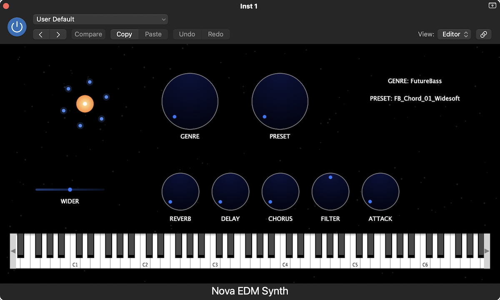

# Nova EDM Synth (JUCE)

Nova is a custom EDM synthesizer plugin built using the JUCE framework, designed for modern electronic music production.

## Features
- ADSR envelope
- Stereo widening
- Built-in Reverb, Delay, Chorus
- Filter control
- MIDI keyboard input
- Custom animated UI
- Genre & preset system

## Plugin UI

## Built With
- C++
- JUCE Framework
- VST3 / AU
- Xcode (macOS)

## Author
Vishnu Kumar
